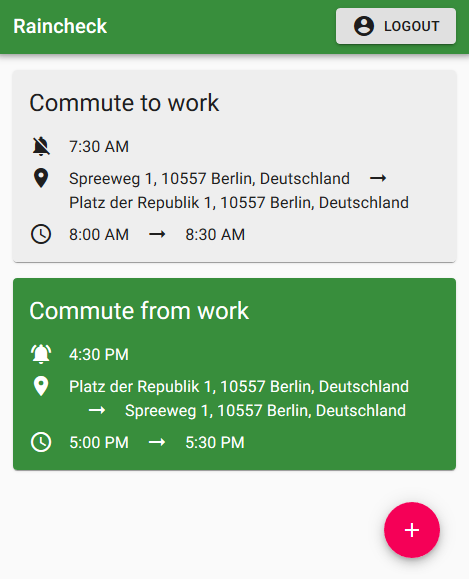
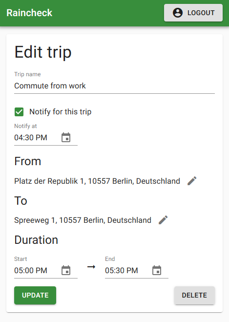

# Raincheck

The app that tells you about the weather when you need it.
Get personalized weather notifications for your recurring trips.

Raincheck is a three-part project:

* [raincheck-db](https://github.com/flocodes/raincheck-db): SQL database for trips with a GraphQL interface, built with [graphql-yoga](https://github.com/prisma-labs/graphql-yoga), [Prisma](https://www.prisma.io/), the [HERE Geocoding API](https://developer.here.com/products/geocoding-and-search) and [Docker](https://www.docker.com/)
* [raincheck-notify](https://github.com/flocodes/raincheck-notify): Weather notification service with direct SQL access to the database, built with [Sendgrid](https://sendgrid.com/) and the [DarkSky forecast API](https://darksky.net/dev/docs)
* [raincheck-web](https://github.com/flocodes/raincheck-web): Single-page web app for managing trips, built with [React](https://reactjs.org/), [Apollo Client](https://www.apollographql.com/docs/react/) and [Material-UI](https://material-ui.com/)

All three project parts use [Typescript](https://www.typescriptlang.org/).

## raincheck-web

  
  

This project was bootstrapped with [Create React App](https://github.com/facebook/create-react-app).

### Project setup

1. Run `yarn install` in the directory you cloned this repository.

2. If you are using `raincheck-web` with a production build of `raincheck-db` that is not running locally, you have to set the environment variable `REACT_APP_DB_URI` to the `raincheck-db` URI.
You can do this with a `.env` file.

### Running raincheck-web

`raincheck-db` must be running before starting `raincheck-web`.

* To run a development build with hot reloads, run `yarn run start`
* For production, first run `yarn run build`, then `serve -s build`

### Linting and testing

To run ESLint and a very basic smoke test, run `yarn run lint` and `yarn run test`, respectively.
This repository contains a GitHub Action that automatically runs these steps on every push.
